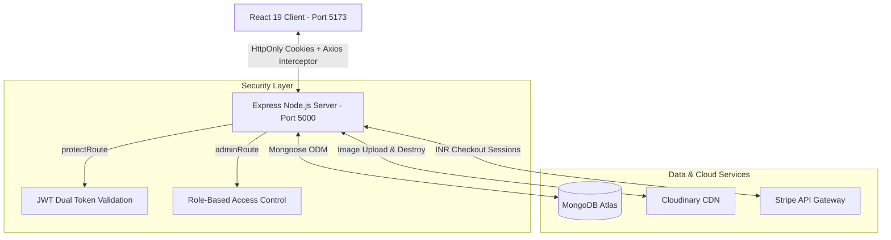

# 🛍️ Enterprise Full-Stack E-Commerce Store & Admin Dashboard


> 🔐 **Featured Security Architecture**: Enterprise Dual-Token Authentication (Short-lived Access Tokens + 7-day Refresh Tokens) stored in secure `httpOnly`, `sameSite: "strict"` cookies with **Axios Queue-Locked Interceptors** for transparent, silent background token renewals.

A production-grade, enterprise full-stack **E-Commerce Storefront & Admin Dashboard** built from scratch using **React 19, Vite, Node.js, Express 5, MongoDB Atlas, Stripe (INR), Cloudinary, and Tailwind CSS with JWT Dual Token-Rotation Auth!**.

---

## 🏗️ System Architecture



---

## 🌟 Key Features

### 👑 Admin Dashboard (`/secret-dashboard`)
* **Real-Time KPI Stat Cards**: Overview of Total Users, Catalog Products, Total Orders, and Gross Revenue.
* **Visual Sales Analytics**: Interactive 7-day revenue and order trend line charts powered by `Recharts`.
* **Cloudinary Product Creator**: Form accepting image uploads converted directly to Cloudinary CDN URLs.
* **Inventory Data Table**: Browse, search, toggle featured homepage status, and delete products (which automatically destroys cloud assets on Cloudinary).

### 🔒 Enterprise Security & Data Protection
* **Dual-Token Authentication**: Short-lived Access Tokens (15m) + Long-lived Refresh Tokens (7d) stored in `httpOnly`, `sameSite: "strict"`, and `secure` cookies.
* **Silent Token Auto-Refresh**: Axios response interceptor with **queue locking** (`isRefreshing` + `failedQueue`) preventing duplicate token refresh requests.
* **Password Cryptography**: Passwords salted and hashed using `bcryptjs` (10 rounds) via Mongoose `pre("save")` hooks.
* **Anti-Price Tampering**: Server-side product price lookups directly from MongoDB during Stripe session generation.
* **Order Idempotency**: `Order.findOne({ stripeSessionId })` prevents duplicate order creation on page refreshes.

### 🛒 Customer Storefront
* **Dynamic Home Hero Slider**: Auto-sliding carousel showcasing featured products.
* **Category Filtering**: Browse items by category (`shoes`, `clothing`, `electronics`, `accessories`).
* **Random Recommendation Engine**: MongoDB `$sample` aggregation displaying random product recommendations ("You May Also Like").
* **Persistent Database Cart**: Cart items saved directly to MongoDB (`user.cartItems`), persisting across user devices and sessions.
* **Stripe INR Checkout**: PCI-compliant payment checkout processing amounts in **Indian Rupees (₹)** with paise precision.
* **Dynamic Delivery Fee Engine**: Free delivery on orders $\ge$ ₹500, otherwise applies a ₹50 shipping fee.
* **Coupon System**: Single-use reward gift coupons and global promo codes (`WELCOME10`, `SAVE15`, `NEXUS10`) with automatic expiration checks.
* **Order History**: View complete past orders with itemized receipts and payment references.

---

## 🛠️ Tech Stack

| Domain | Technologies Used |
| :--- | :--- |
| **Frontend Core** | React 19, Vite, React Router DOM v7 |
| **Styling & Motion** | Tailwind CSS, Framer Motion, Lucide Icons, Canvas Confetti |
| **State Management** | Zustand (User, Cart, Product, Theme stores) |
| **HTTP & Toast** | Axios, React Hot Toast |
| **Charts & Visualization** | Recharts |
| **Backend Runtime** | Node.js, Express 5 |
| **Database & ODM** | MongoDB Atlas, Mongoose 9 |
| **Cloud Storage** | Cloudinary SDK v2 |
| **Payments** | Stripe Node.js SDK (INR / Paise) |
| **Security** | JSON Web Tokens (`jsonwebtoken`), `bcryptjs`, `cookie-parser`, `cors` |

---

## 📁 Directory Structure

```
E-COM/
├── backend/
│   ├── config/
│   │   └── db.js                 # MongoDB Mongoose connection manager
│   ├── controllers/
│   │   ├── analyticsController.js # Sales aggregation & 7-day chart pipelines
│   │   ├── authController.js      # Signup, login, logout, refresh token, profile
│   │   ├── cartController.js      # Cart CRUD & batch $in product lookup
│   │   ├── couponController.js    # Coupon validation & expiration auto-deactivation
│   │   ├── paymentController.js   # Stripe Checkout sessions in INR & Order creation
│   │   └── productController.js   # Product CRUD, Cloudinary upload & $sample recommendations
│   ├── lib/
│   │   ├── cloudinary.js         # Cloudinary SDK configuration
│   │   ├── stripe.js             # Stripe SDK configuration
│   │   └── tokens.js             # JWT token generator & HttpOnly cookie setter
│   ├── middleware/
│   │   └── authMiddleware.js     # protectRoute & adminRoute middleware
│   ├── models/
│   │   ├── couponModel.js        # Coupon Schema
│   │   ├── orderModel.js         # Order Schema
│   │   ├── productModel.js       # Product Schema
│   │   └── userModel.js          # User Schema with bcrypt hooks
│   ├── routes/                   # Express API route bindings
│   ├── .env                      # Environment variables configuration
│   ├── package.json
│   └── server.js                 # Express server entry point
└── frontend/
    ├── src/
    │   ├── components/           # Reusable UI components (Navbar, Footer, HeroCarousel, etc.)
    │   ├── lib/
    │   │   └── axios.js          # Custom Axios instance with queue-locked refresh interceptor
    │   ├── pages/                # Page views (HomePage, AdminPage, CartPage, etc.)
    │   ├── stores/               # Zustand state stores (useUserStore, useCartStore, etc.)
    │   ├── App.jsx               # Application routes & layout
    │   ├── main.jsx              # React DOM entry point
    │   └── index.css             # Tailwind CSS & custom utilities
    ├── package.json
    └── vite.config.js
```

---

## 🚀 Getting Started

### Prerequisites
* Node.js v18+ installed
* MongoDB Atlas account & connection URI
* Stripe account (Test Mode secret key)
* Cloudinary account (Cloud Name, API Key, API Secret)

---

### 1. Setup Backend

```bash
cd backend
npm install
```

Create a `.env` file inside `backend/`:

```env
PORT=5000
MONGO_URI=your_mongodb_atlas_connection_string
NODE_ENV=development

# Authentication JWT Secrets
ACCESS_TOKEN_SECRET=your_super_secret_access_token_key
REFRESH_TOKEN_SECRET=your_super_secret_refresh_token_key

# Cloudinary Configuration
CLOUDINARY_CLOUD_NAME=your_cloudinary_cloud_name
CLOUDINARY_API_KEY=your_cloudinary_api_key
CLOUDINARY_API_SECRET=your_cloudinary_api_secret

# Stripe Payment Gateway (Test Mode)
STRIPE_SECRET_KEY=sk_test_51...

# Client Origin
CLIENT_URL=http://localhost:5173
```

Start the backend development server:
```bash
npm run dev
```

---

### 2. Setup Frontend

Open a new terminal window:

```bash
cd frontend
npm install
```

Start the Vite development server:
```bash
npm run dev
```

Open your browser at `http://localhost:5173` 🎉!

---

## 🔗 API Endpoint Reference

### Authentication (`/api/auth`)
* `POST /api/auth/signup` - Register a new customer account
* `POST /api/auth/login` - Authenticate user & receive HttpOnly cookies
* `POST /api/auth/logout` - Revoke cookies
* `POST /api/auth/refresh-token` - Issue fresh access token cookie
* `GET /api/auth/profile` - Fetch current user profile (Protected)

### Products (`/api/products`)
* `GET /api/products/featured` - Get products flagged `isFeatured: true`
* `GET /api/products/category/:category` - Get products by category slug
* `GET /api/products/recommendations` - Get 4 random products via `$sample`
* `GET /api/products` - Get all products (Admin Only)
* `POST /api/products` - Create product & upload image to Cloudinary (Admin Only)
* `PATCH /api/products/:id` - Toggle product featured status (Admin Only)
* `DELETE /api/products/:id` - Delete product & destroy Cloudinary image (Admin Only)

### Cart (`/api/cart`)
* `GET /api/cart` - Get user's cart products with merged details (Protected)
* `POST /api/cart` - Add item to cart or increment quantity (Protected)
* `PUT /api/cart/:id` - Update quantity or remove if 0 (Protected)
* `DELETE /api/cart` - Remove single item or clear entire cart (Protected)

### Coupons (`/api/coupons`)
* `GET /api/coupons` - Fetch active coupon assigned to logged-in user (Protected)
* `POST /api/coupons/validate` - Validate coupon code & return discount % (Protected)

### Payments (`/api/payments`)
* `POST /api/payments/create-checkout-session` - Create Stripe Checkout session in INR (Protected)
* `POST /api/payments/checkout-success` - Verify payment & save Order document (Protected)

### Analytics (`/api/analytics`)
* `GET /api/analytics` - Fetch business KPIs & 7-day sales chart metrics (Admin Only)

---

## 📜 License

Distributed under the MIT License. See `LICENSE` for more information.
